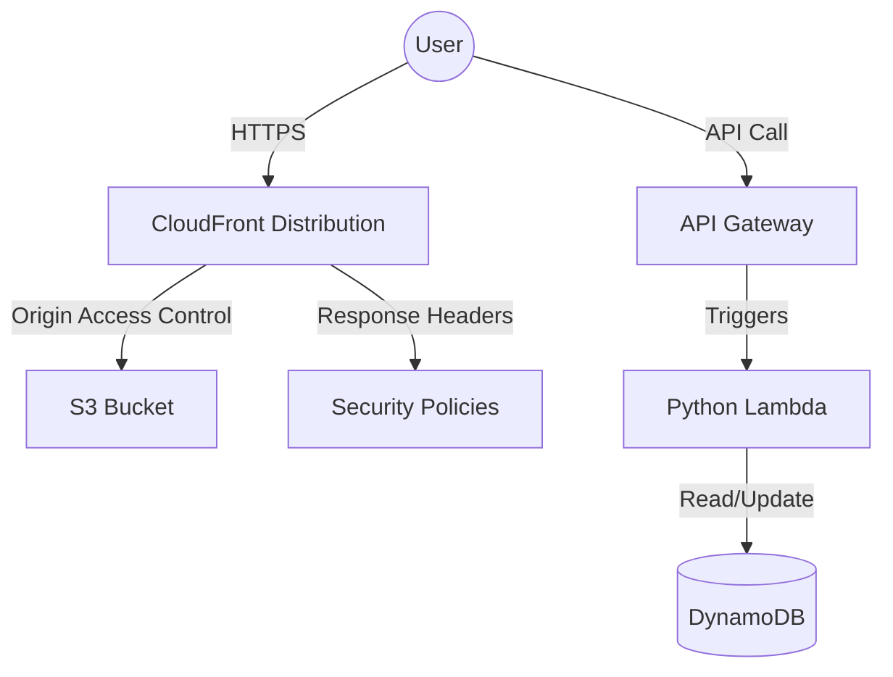

<div align="center">
  
  <br/>
  <h1>AWS Cloud Resume Challenge</h1>
  <p><strong>A cloud-native, highly secure, and aesthetically driven Next.js portfolio.</strong></p>
  
  <p>
    
    
    
    
    
  </p>

  <p>
    <a href="https://anfernee.dev">View Live Site</a> •
    <a href="#architecture">Architecture</a> •
    <a href="#security-first-approach">Security</a> •
    <a href="#deployment">Deployment</a>
  </p>
</div>

---

## 🚀 Overview

This repository houses my professional portfolio, built to complete the **[AWS Cloud Resume Challenge](https://cloudresumechallenge.dev/docs/the-challenge/aws/)**. It serves as both a high-performance web presence and a practical demonstration of my cloud engineering and frontend development skills.

Currently pursuing the **AWS Certified Developer Associate (DVA-C02)**, this project applies serverless architecture, Infrastructure as Code (IaC), and strict security principles.

## 🏗️ Architecture

The application is split into a static frontend export and a serverless backend API.



### 💻 Frontend (Next.js)
- **Framework**: Next.js (App Router) statically exported (`output: 'export'`).
- **Styling**: Tailwind CSS with Framer Motion for high-fidelity animations and a premium editorial aesthetic.
- **Internationalization**: Full i18n support (English/Spanish) using `next-intl`.

### ☁️ Backend & Infrastructure (AWS SAM)
- **Database**: DynamoDB (On-Demand) storing the global visitor count.
- **Compute**: AWS Lambda written in Python, using `boto3` for atomic database increments.
- **API**: HTTP API Gateway exposing the Lambda function.
- **Hosting**: Amazon S3 (Private) delivered via CloudFront Edge Locations.
- **DNS**: Amazon Route 53 with custom domain (`anfernee.dev`) and ACM certificates.

## 🔒 Security First Approach

Security was a paramount consideration in this build. No environment variables are exposed, and strict AWS policies are enforced:

- **CloudFront OAC**: The S3 bucket is completely private. Direct access is blocked; it can only be accessed via the CloudFront distribution using Origin Access Control (OAC).
- **Least Privilege IAM**: The Lambda execution role has minimal permissions—only allowing `GetItem` and `UpdateItem` on the specific DynamoDB table.
- **Strict CORS**: The API Gateway strictly enforces CORS, only allowing requests originating from `https://anfernee.dev`.
- **Security Headers**: CloudFront Response Headers policies automatically inject HSTS, X-Content-Type-Options, X-Frame-Options, and XSS Protection headers into every response.

## 🛠️ Deployment

Infrastructure is fully codified using **AWS Serverless Application Model (SAM)** and CloudFormation. Deployments are executed via robust bash scripts that generate CloudFormation Change Sets, ensuring manual review before applying infrastructure mutations.

```bash
# Deploy Backend Stack (API & Database)
./infrastructure/bin/deploy-backend.sh

# Build Frontend (Automatically fetches API URL from CloudFormation)
./infrastructure/bin/build-frontend.sh

# Deploy Frontend Stack (CloudFront & S3)
./infrastructure/bin/deploy-cloudfront.sh
```

## 📝 Blog Post

Read about the technical challenges I faced and the lessons learned while building this architecture:
*[Link to Blog Post coming soon...]*
